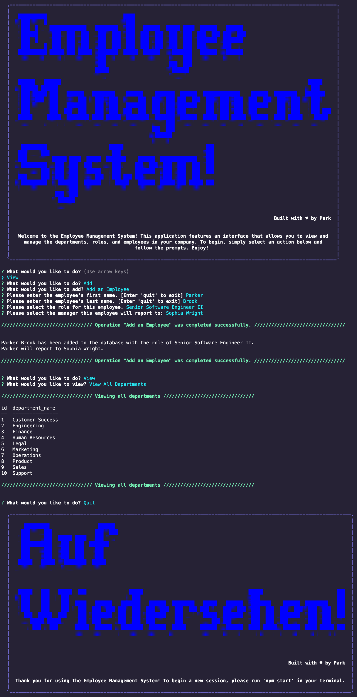

# SQL Employee Tracker 

## Description 
This application is an employee management system (EMS) that allows company administrators to easily manage their employees, roles, and departments within a database by utilizing a suite of view, add, update, and delete database operations.

## Table of Contents

* [Installation](#installation)
* [Usage](#usage)
* [Credits](#credits)
* [License](#license)
* [Features](#features)
* [Contributing](#contributing)
* [Tests](#tests)
* [Questions](#questions)

## Video Demonstration
[Link to video demonstration](https://drive.google.com/file/d/11-MckS0ouddvVvNC5obYTVh347DcRvnr/view)

## Screenshot

## Installation 
1. First, clone this repository to your local machine. 

2. Open a terminal in the cloned director and run "npm i" to install all necessary dependencies.

3. Rename the ".env.example" file to ".env", open it, and update DB_USER and DB_PASSWORD with your MySQL credentials. 

4. (Optional) For testing or demonstration purposes, you can open a new terminal in the "/db" folder, sign in to MySQL using the command "mysql -u root -p", and run the two .sql database files using the commands "source schema.sql;" followed by "source seeds.sql;", in that order. This will create and populate the database with some sample data.

## Usage 
In a terminal opened in the cloned directory, type "npm start" to initialize the EMS. Doing so will present the user with an ASCII art splash screen and begin the first prompt. To perform database operations, simply follow the prompts corresponding with that operation. Selecting "Quit will render the goodbye splashscreen and end the connection.

## Credits 
N/A

## License
This application is covered under the [MIT](https://opensource.org/licenses/MIT) license.

## Features 
This project heavily utilizes MySQL and inquirer, as well as asciiart-logo for the creation of the welcome and goodbye splashscreens, dotenv for the use of environment variables, and console.table for the viewing of tables in the console.

## Contributing 
N/A

## Tests 
N/A

## Questions 
* You can find me on GitHub at [pbodybrooks](https://github.com/pbodybrooks). 
* Please do not hesitate to reach out to me via my email: parkerlamarbrook@gmail.com.